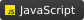

# 👋 Salut, moi c’est Sacha / Hi, I'm Sacha
**Me contacter / Contact me :** [**LinkedIn**](https://www.linkedin.com/in/sacha-cardone)

 

| **Développeur Full-Stack** | **<->** | **Full-Stack Developer** |
| :---: | :---: | :---: |
| **Passionné optimisation système** | **<->** | **System Optimization Enthusiast** |

 

---

 

### 🚀 Vision
> **FR :** Développeur passionné par le code, les systèmes et l’amélioration continue.  
> **EN :** Passionate developer focused on code, systems, and continuous improvement.

 

### 👤 À propos / About
| [**Consulter mon profil**](docs/README.fr.md) | [**View my profile**](docs/README.en.md) |
| :---: | :---: |
| *Compétences, stacks et philosophie* | *Skills, stacks, and philosophy* |

 

### 📊 Stack Overview / Résumé Technique

- ***Langages / Languages*** ➜
  
  
  
  
  
  
  

- ***Web & Backend*** ➜
  
  
  
  
  

- ***Infrastructure & Systèmes / Systems*** ➜
  
  
  
  

- ***Bases de données / Databases*** ➜
  
  
  
  
  

. . . . . . . .

 

> ***...et bien plus encore / and much more.***
